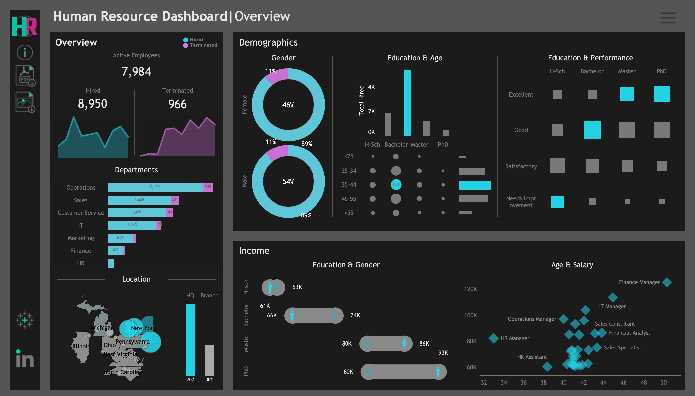

# HR Analytics Dashboard | Tableau

Welcome to my **HR Analytics Dashboard**, built using **Tableau Public**. This project visualizes key HR metrics to help organizations make informed, data-driven decisions about their workforce.

🔗 **Live Dashboard**: [Click to Explore](https://public.tableau.com/app/profile/deepshika.murali/viz/HRDashboardDeepshi/HRSummary)

---

## 📌 Project Overview

This interactive dashboard offers a high-level summary of HR insights, focusing on:

- 📈 **Attrition Trends** – Track monthly attrition and headcount changes  
- 🧑‍🤝‍🧑 **Employee Demographics** – View distributions by gender, education, department, and more  
- 💼 **Department Insights** – Understand department-wise headcount and satisfaction levels  
- 📊 **Performance & Satisfaction** – Analyze job satisfaction and performance ratings by category  

---

## 🛠️ Tools & Technologies

- **Tableau Public** – For building and publishing the dashboard  
- **Excel** – For data preparation and cleaning (if applicable)  

---

## 📁 Dataset Info

This dashboard uses a sample HR dataset that includes:
- Age, Gender, Department, and Education Field  
- Monthly Income and Job Level  
- Attrition status  
- Job Satisfaction & Performance Ratings  

> *(Dataset is for educational and visualization purposes only. No sensitive employee data used.)*

---

## 🎯 Why This Dashboard?

HR teams often struggle with scattered data and delayed insights. This dashboard provides:

✅ A centralized, interactive view of key HR metrics  
✅ Quick visual insights to support decision-making  
✅ Filters for deeper analysis across dimensions  

---

## 🧩 Features

- Filter by department, gender, or education  
- Dynamic visual breakdowns of attrition and satisfaction  
- Clean, intuitive design for stakeholder-friendly use  

---

## 📬 Let’s Connect

Got feedback or ideas for collaboration?  
Feel free to reach out or connect on [LinkedIn](https://www.linkedin.com/in/deepshika-murali-9850991aa/) or fork this project!